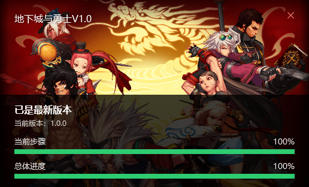
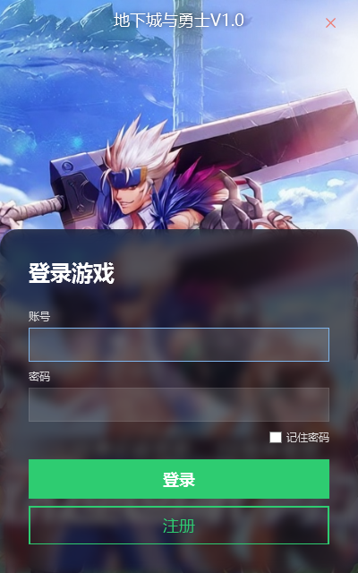
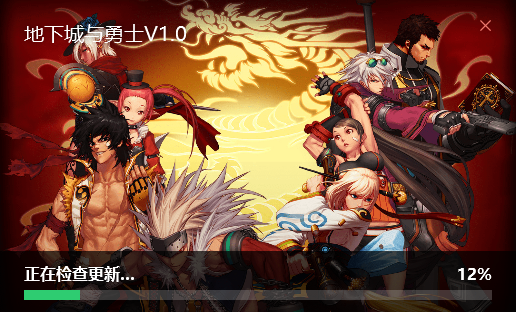
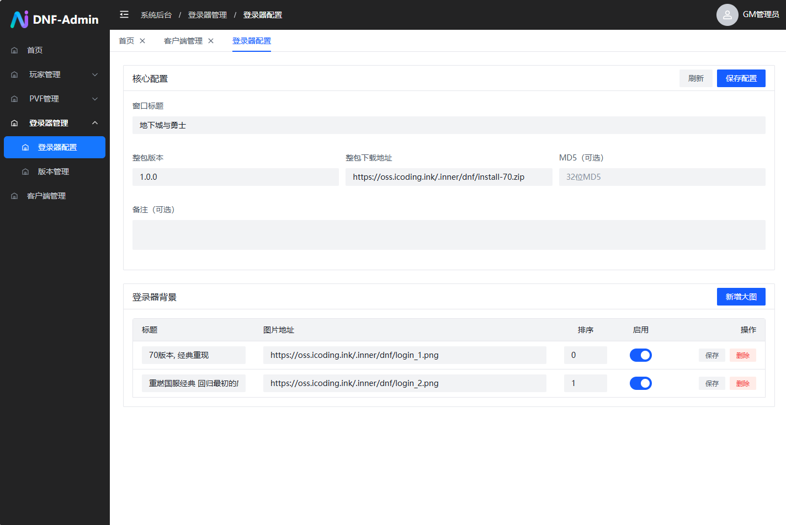

# DOF 下载更新一体化登陆器

> 🚀 一款集下载、更新、远程配置于一体的 DOF（Dungeon of Fantasy）游戏启动器。需搭配 [DOF 后台系统](https://github.com/onlyGuo/dnf-server-public)共同使用。

## 推广
一个好玩的大模型聚合平台: [https://gpt.0101.run](https://gpt.0101.run)
便宜且稳定的大模型API分发平台 [https://0101.run](https://0101.run)

## ✨ 特性总览
- **自动检测并下载完整客户端**：空目录运行即可获取全量包（NPK、PVF 等）。
- **智能增量更新**：已存在客户端时，仅获取后台配置的增量资源。
- **后台可定制 UI**：背景、标题、语言等一键下发。
- **远程配置同步**：多项游戏参数支持在线调整。

## 📥 自动下载
首次运行若目录为空，启动器会自动调用后台提供的全量包下载地址，并解压到当前目录，快速构建可用的游戏环境。

## 🔄 自动更新
检测到已有游戏文件时，会对比当前版本与后台最新版本，按需下载增量补丁，节省时间与带宽。

## 🎨 后台可配置外观
启动器会在启动时请求样式配置，支持：
- 背景图片
- 标题及多语言文案

## ⚙️ 远程配置下发

可下发的客户端配置包括但不限于：
- 服务器地址（IP）
- 角色等级上限
- 一键卖出/分解品质
- 无损画质档位、SSS 评分
- 本地 GM、史诗装备确认、英雄级开关
- 物品图标补丁、第二名称开关、自定义品级文本
- 简体 PVF 适配、前置快捷键、连发按钮
- 自动拾取、副本难度命名、自动翻拍、史诗闪光等

> 📎 更多配置项可通过后台面板扩展，满足不同版本的定制需求。
